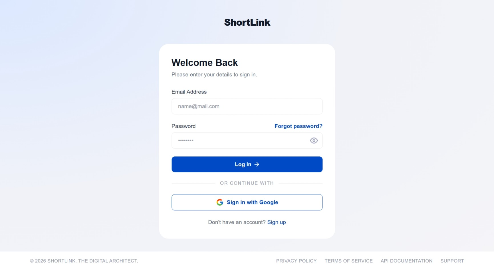
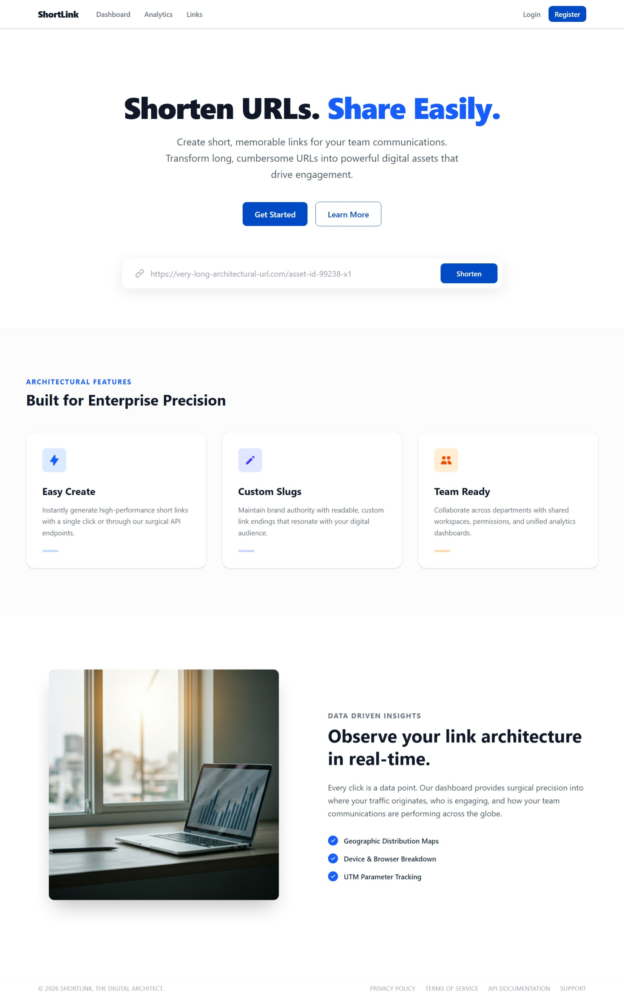
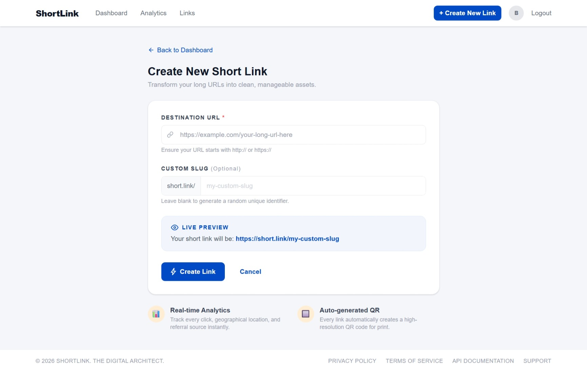
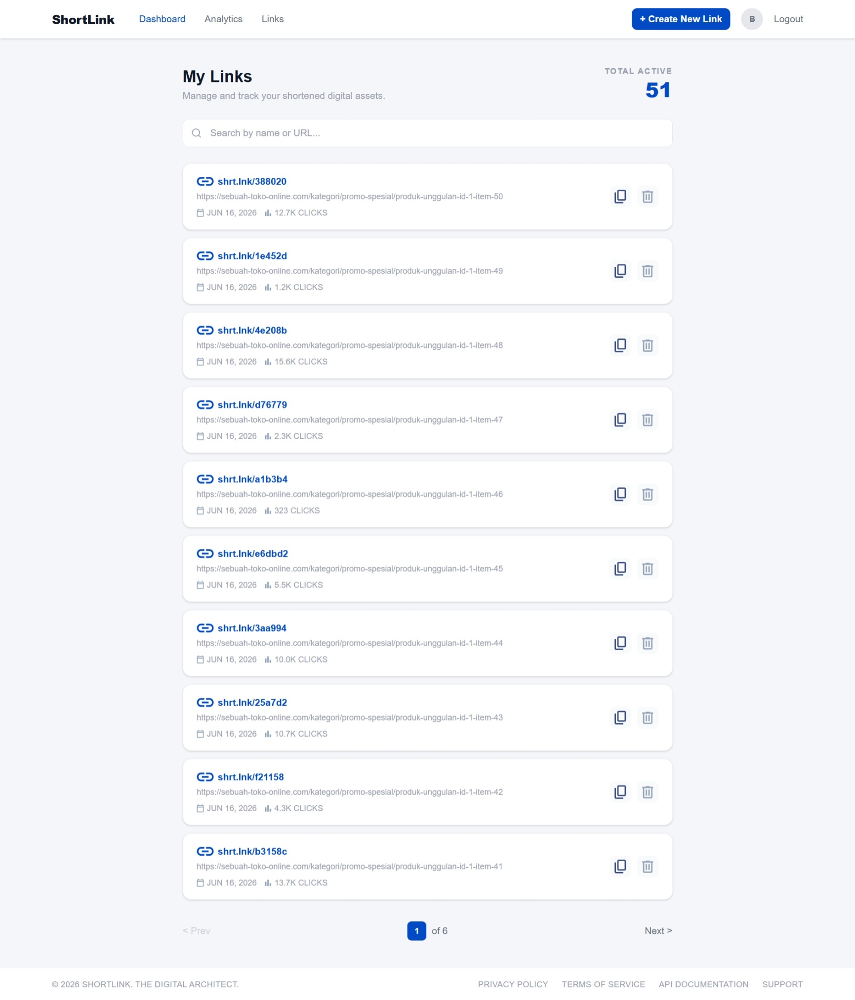

# ShortLink App - Frontend

[](https://opensource.org/license/mit)

## About ShortLink-app

ShortLink-app is a fast and intuitive URL shortening web application.
Built with React.js, JavaScript, and Redux, it allows users to easily manage and customize their links. Features include:

- Mobile-First Responsive UI
- Generate concise short links from long URLs
- Customize links with unique aliases for branding
- Copy and share links effortlessly
- Interactive dashboard for Link and Profile Management

From simplifying clumsy URLs to organizing your shared links — ShortLink-app makes link sharing effortless.

## Preview






## Technologies Used

- [](https://react.dev/)
- [](https://vitejs.dev/)
- [](https://tailwindcss.com/)
- [](https://redux-toolkit.js.org/)
- [](https://nginx.org/)
- [](https://www.docker.com/)

## Environment

```sh
VITE_API_URL=<your_backend_addres>
```

## ⚙️ Installation

1. Clone the project

```sh
$ https://github.com/L1mus/short-link-app
```

2. Navigate to project directory

```sh
$ cd client
```

3. Install dependencies

```sh
$ npm install
```

4. Run project

```sh
$ npm run dev
```

## Changelog

| Version | Description                                                                                                      |
| ------- | -----------------------------------------------------------------------------------------------------------------|
| 1.0     | Setup Docker multi-stage build, Nginx and setup GitHub Actions for GHCR deployment|

## How to Contribute

- Fork this repository
- Create your changes
- Commit your changes (Please strictly follow the [Conventional Commits](https://www.conventionalcommits.org/en/v1.0.0/) standard: `feat:`, `fix:`, `chore:`, `docs:`)
- Push to the branch
- Open a Pull Request

## Related Project

[Backend short-link-app Repository](https://github.com/L1mus/short-link-app/tree/main/server)

Copyright (c) 2026
